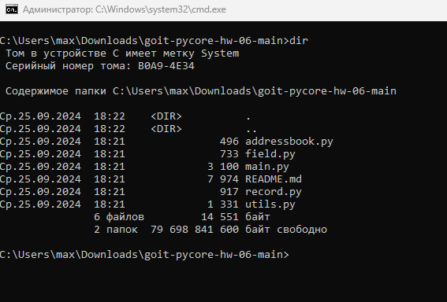
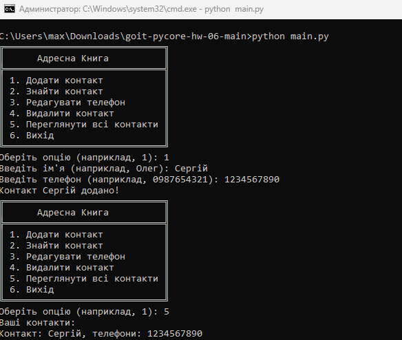

# Тема 9. Домашня робота. Основи роботи з класами

Зараз на вас чекає домашнє завдання, завдяки якому ви навчитеся наступним корисним навичкам:

- Основи об'єктно-орієнтованого програмування (ООП)
- Робота з класами та об'єктами
- Робота з методами класу

#### Формат здачі:

- Розмістіть файли з розв'язанням у репозиторії `goit-pycore-hw-06`, та прикріпіть лінки до них у відповідь на домашнє завдання.
- Прикріпіть файл репозиторію у форматi `zip` у відповідь на домашнє завдання.

> [!NOTE]
>
> ☝ У цій домашній роботі ми продовжимо розвивати нашого віртуального асистента з CLI інтерфейсом.

Наш асистент вже вміє взаємодіяти з користувачем за допомогою командного рядка, отримуючи команди та аргументи, та виконуючи потрібні дії. У цьому завданні потрібно буде попрацювати над внутрішньою логікою асистента, над тим, як зберігаються дані, які саме дані і що з ними можна зробити.

> [!TIP]
>
> ☝ Саму логіку ми додамо в бота в наступному домашньому завданні.

Застосуємо для цих цілей об'єктно-орієнтоване програмування. Спершу виділимо декілька сутностей (моделей), з якими працюватимемо.

- У **користувача** буде адресна книга або **книга контактів**. Ця **книга контактів** містить **записи**. Кожен **запис** містить деякий набір **полів**.

Таким чином ми описали сутності (класи), які необхідно реалізувати. Далі розглянемо вимоги до цих класів та встановимо їх взаємозв'язок, правила, за якими вони будуть взаємодіяти.

- Користувач взаємодіє з **книгою контактів**, додаючи, видаляючи та редагуючи **записи**. Також користувач повинен мати можливість шукати в **книзі контактів записи** за одним або кількома критеріями (полями).
- Про **поля** також можна сказати, що вони можуть бути обов'язковими (ім'я) та необов'язковими (телефон або email наприклад). Також **записи** можуть містити декілька **полів** одного типу (декілька телефонів наприклад). Користувач повинен мати можливість додавати/видаляти/редагувати **поля** у будь-якому записі.

## Технiчний опис завдання

Розробіть систему для управління адресною книгою.

#### Сутності:

- `Field`: Базовий клас для полів запису.
- `Name`: Клас для зберігання імені контакту. Обов'язкове поле.
- `Phone`: Клас для зберігання номера телефону. Має валідацію формату (10 цифр).
- `Record`: Клас для зберігання інформації про контакт, включаючи ім'я та список телефонів.
- `AddressBook`: Клас для зберігання та управління записами.

#### Функціональність:

- `AddressBook`: Додавання записів.
- Пошук записів за іменем.
- Видалення записів за іменем.
- `Record`: Додавання телефонів.
- Видалення телефонів.
- Редагування телефонів.
- Пошук телефону.

### Рекомендації для виконання

В якості старту ви можете взяти наступний базовий код для реалізації цього домашнього завдання:

```bash
from collections import UserDict

class Field:
def **init**(self, value):
self.value = value

    def __str__(self):
        return str(self.value)

class Name(Field): # реалізація класу
pass

class Phone(Field): # реалізація класу
pass

class Record:
def **init**(self, name):
self.name = Name(name)
self.phones = []

    # реалізація класу

    def __str__(self):
        return f"Contact name: {self.name.value}, phones: {'; '.join(p.value for p in self.phones)}"

class AddressBook(UserDict): # реалізація класу
pass
```

Після реалізації ваш код має виконуватися наступним чином:

```bash
# Створення нової адресної книги

    book = AddressBook()

    # Створення запису для John
    john_record = Record("John")
    john_record.add_phone("1234567890")
    john_record.add_phone("5555555555")

    # Додавання запису John до адресної книги
    book.add_record(john_record)

    # Створення та додавання нового запису для Jane
    jane_record = Record("Jane")
    jane_record.add_phone("9876543210")
    book.add_record(jane_record)

    # Виведення всіх записів у книзі
    for name, record in book.data.items():
        print(record)

    # Знаходження та редагування телефону для John
    john = book.find("John")
    john.edit_phone("1234567890", "1112223333")

    print(john)  # Виведення: Contact name: John, phones: 1112223333; 5555555555

    # Пошук конкретного телефону у записі John
    found_phone = john.find_phone("5555555555")
    print(f"{john.name}: {found_phone}")  # Виведення: 5555555555

    # Видалення запису Jane
    book.delete("Jane")
```

В наступному домашньому завданні ми додамо цю логіку до нашого бота.

### Критерії оцінювання

**Клас** `AddressBook`:

- Реалізовано метод `add_record`, який додає запис до `self.data`.
- Реалізовано метод `find`, який знаходить запис за ім'ям.
- Реалізовано метод `delete`, який видаляє запис за ім'ям.

**Клас** `Record`:

- Реалізовано зберігання об'єкта `Name` в окремому атрибуті.
- Реалізовано зберігання списку об'єктів Phone в окремому атрибуті.
- Реалізовано методи для додавання - `add_phone`/видалення - `remove_phone`/редагування - `edit_phone`/пошуку об'єктів `Phone` - `find_phone`.

**Клас** `Phone`:

- Реалізовано валідацію номера телефону (має бути перевірка на 10 цифр).

- ### Результат виконаного ДЗ





